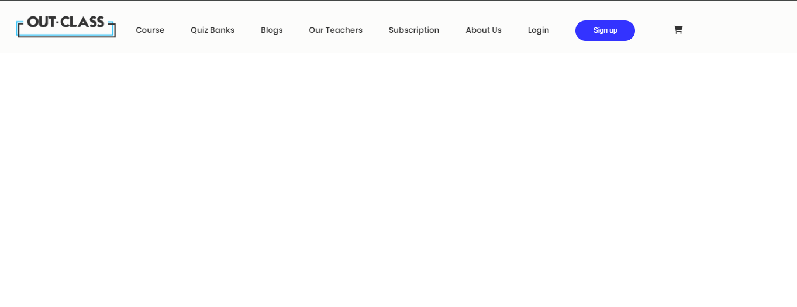
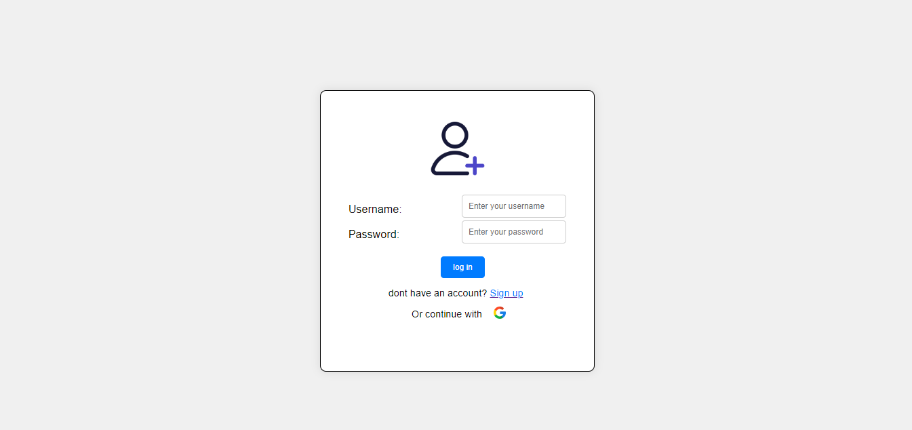
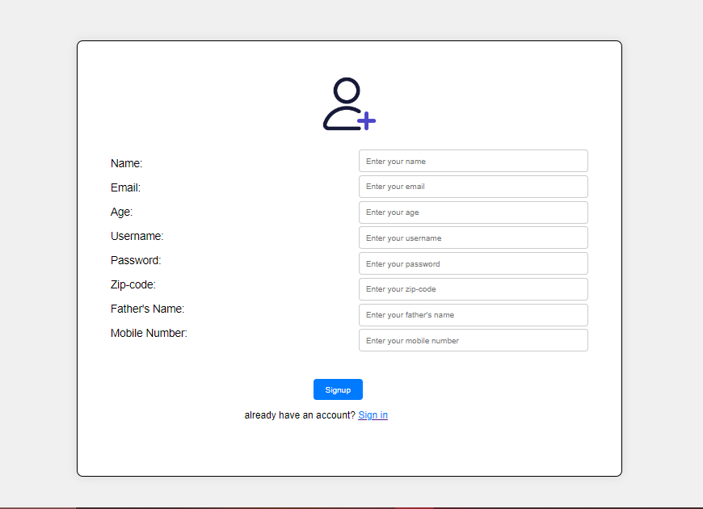
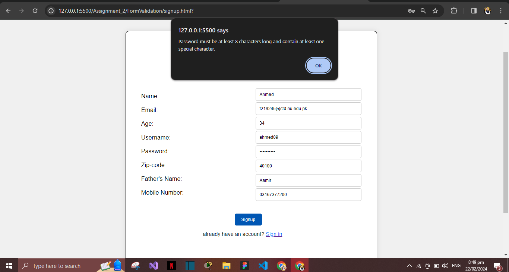
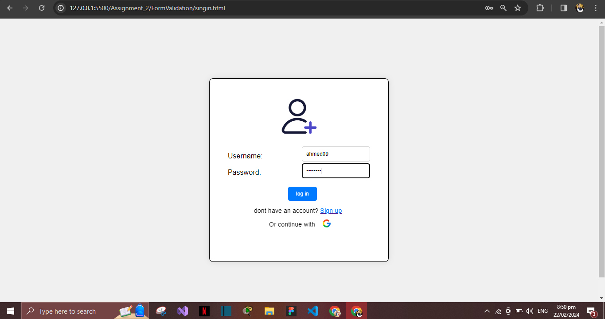

# Assignment_2
Form validation using javascript
# C++ Notepad Project

## Overview

The C++ Notepad project is a simple text editor implemented in C++ using various data structures. It provides basic functionality for creating, editing, and saving text documents.

## Screenshots

Home page

Login Page

br
Sign Up page

Enteries

Enteries## License

This project is licensed under the MIT License - see the [LICENSE.md](LICENSE.md) file for details.
